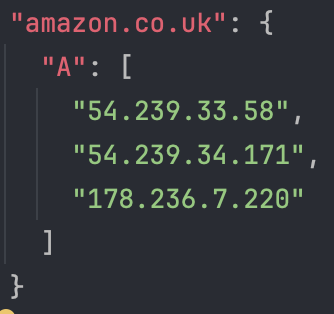
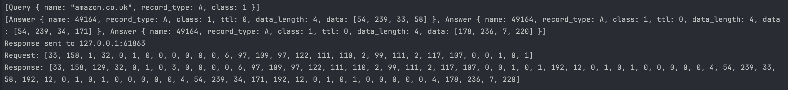
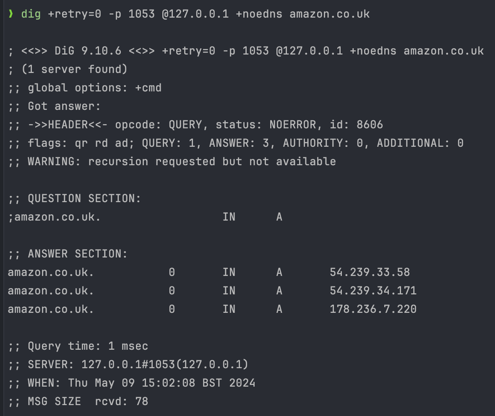

# A simple low-level DNS resolver
This project consists of writing a DNS server from scratch in Rust, based on RFCs 1034 and 1035. The server listens for a stream of bytes representing the DNS message on a UDP port, decodes it, looks for a resource record (RR) matching the query, and returns the encoded information back to the origin. The resource record is currently being held in records.json

The server can be run by passing the port as an argument. You can pick any as long as it is not being used or reserved.
```bash
cargo run 1053
```

Its functionality can be tested with a tool like `dig` on localhost and the specific port. In the following example, we are asking the server for the A records of the domain name example.com.
```bash
dig +retry=0 -p 1053 @127.0.0.1 +noedns example.com A
```
## Records
`A` records for amazon.co.uk stored in `records.json`.
<figure>
  
</figure>

## Input and output stream
Stream of bytes from the query and the response message sent back to the origin. As we can see, one response has been sent for each RR and correspond to the ones in `records.json`. 
<figure>
  
</figure>

## Using dig
Interpretation of the DNS message by the `dig` tool.
<figure>
  
</figure>

## Further reading
A detailed overview of the project can be found in this [paper](paper.pdf).
